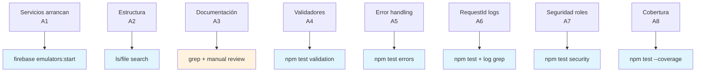

# QA: Criterios de Aceptación para Etapa A (Fundación Técnica)

**Responsable**: QA Agent  
**Etapa**: A - Fundación  
**Fecha Prep**: 2026-04-07  
**Objetivo**: Define testability y validación para la base técnica del backend CowBnB.

---

## ÍNDICE

1. [Estrategia de Pruebas Unitarias](#1-estrategia-de-pruebas-unitarias)
2. [Requisitos de Pruebas de Integración](#2-requisitos-de-pruebas-de-integración)
3. [Checklist QA Manual para Etapa A](#3-checklist-qa-manual-para-etapa-a)
4. [Requisitos de Observabilidad](#4-requisitos-de-observabilidad)
5. [Criterios de Done Testeable (Reescritura 6.0A)](#5-criterios-de-done-testeable)
6. [Testing Basado en Riesgos](#6-testing-basado-en-riesgos-etapa-a)

---

## 1. Estrategia de Pruebas Unitarias

### 1.1 Qué Probar en Etapa A

#### Categoría 1: Validadores (`backend/shared/validation/*`)

**Módulos a testear:**
- `validateEmail(email: string): ValidationResult`
- `validatePhonePrefix(prefix: string): ValidationResult`
- `validatePhone(phone: string): ValidationResult`
- `validateUserRole(role: string): ValidationResult`
- `validateTerrainFields(data: TerrainInput): ValidationResult`
- `validateReservaFechas(startDate: Date, endDate: Date): ValidationResult`
- `validateMonedaPositiva(amount: number): ValidationResult`

**Casos de prueba por validador:**

| Validador | Caso Válido | Caso Inválido 1 | Caso Inválido 2 | Caso Edge |
|-----------|-------------|-----------------|-----------------|-----------|
| email | `"user@example.com"` | `"invalid@"` | `"@example.com"` | `""` (vacío) |
| phone_prefix | `"+1"`, `"+56"` | `"1"` (sin +) | `"++1"` | `"+0"` |
| phone | `"9123456789"` (10 dígitos) | `"912345678"` (9) | `"91234567890"` (11) | Caracteres especiales |
| role | `"owner"`, `"renter"` | `"admin"` | `"OWNER"` (case) | `null` |
| terrain.title | Mín 5 chars | Mín 4 chars | Vacío | Unicode permitido |
| terrain.hectares | `1.5` | `0` | `-10` | `999999` (máximo) |
| terrain.priceMonthly | `50000` | `0` | `-1000` | Decimales |
| reserva.dates | `endDate > startDate` | Iguales | `endDate < startDate` | Hoy vs futuro |

**Resultado esperado:**
- ✅ Caso válido retorna `{ valid: true, errors: [] }`
- ✅ Caso inválido retorna `{ valid: false, errors: [{ field, message }] }`
- ✅ Todos los errores retornan código de error en Inglés (ej: `INVALID_EMAIL_FORMAT`)

#### Categoría 2: Mapeadores de Estado (`backend/shared/stateMapper.js`)

**Módulos a testear:**
- `mapUIStatusToCanonical(uiStatus: string): string`
- `mapCanonicalStatusToUI(canonicalStatus: string): string`
- `isValidStateTransition(currentStatus, targetStatus): boolean`

**Casos de prueba:**

| Entrada (UI) | Salida Esperada (Canonical) | Test Name |
|---|---|---|
| `"Activo"` | `"disponible"` | map_activo_to_disponible |
| `"Confirmado"` | `"reservado"` | map_confirmado_to_reservado |
| `"Pendiente"` | `"en_espera"` | map_pendiente_to_en_espera |
| `"Inactivo"` | `"inactivo"` | map_inactivo_to_inactivo |

**Transiciones válidas:**
```
disponible → reservado ✅
disponible → en_espera ✅
en_espera → disponible ✅
en_espera → reservado ✅
reservado → disponible (solo backend) ✅
reservado → en_espera ❌ (ERROR)
```

**Resultado esperado:**
- ✅ Llamada a función de mapeo retorna estado correcto
- ✅ Transición inválida lanza error con cod `INVALID_STATE_TRANSITION`
- ✅ Error contiene contexto: `{ from, to, validTransitions }`

#### Categoría 3: Generador de RequestId (`backend/shared/requestId.js`)

**Módulos a testear:**
- `generateRequestId(): string`
- `validateRequestIdFormat(id: string): boolean`
- `extractTimestampFromRequestId(id: string): number`

**Casos de prueba:**

| Test | Expectativa |
|---|---|
| `generateRequestId()` retorna no-vacío | Longitud `>= 16` chars |
| Llamar 100 veces genera 100 IDs únicos | 0 duplicados |
| Formato `TIMESTAMP-RANDOM` | Regex: `^\d{13}-[a-z0-9]{8}$` |
| Timestamp es parseable | JSON.parse(num) válido |
| RequestId es URL-safe | Sin `+`, `/`, `=` |

**Resultado esperado:**
- ✅ Cada ID es único
- ✅ Timestamp es cercano a `Date.now()` (diferencia < 100ms)
- ✅ Formato es consistente entre corridas

#### Categoría 4: Manejo de Errores (`backend/shared/errorHandler.js`)

**Módulos a testear:**
- `createError(code: string, message: string, statusCode: number): AppError`
- `isAppError(err: any): boolean`
- `truncateErrorForClient(error: AppError): object`

**Casos de prueba:**

| Test | Input | Esperado |
|---|---|---|
| Crear error app | `{ code: "AUTH_REQUIRED", message: "Token", status: 401 }` | Objeto con propiedades |
| Error es instancia de AppError | Verificar `instanceof` | ✅ true |
| Truncate excluye detalles sensibles | Error con `internalDetails` | Sin `internalDetails` en output |
| Error en request contiene requestId | Request con `res.locals.requestId` | Field `requestId` en serializado |

**Resultado esperado:**
- ✅ AppError tiene propiedades: `code`, `message`, `statusCode`, `timestamp`
- ✅ Client no recibe `stack`, `internalDetails`, `secret`
- ✅ Server logs incluyen completo, client solo versión truncada

### 1.2 Estructura de Archivos de Pruebas

```
backend/
├── shared/
│   ├── validation.js
│   ├── validation.test.js          ← Tests unitarios
│   ├── stateMapper.js
│   ├── stateMapper.test.js
│   ├── requestId.js
│   ├── requestId.test.js
│   ├── errorHandler.js
│   ├── errorHandler.test.js
│   └── idempotency.js
│       └── idempotency.test.js
├── models/
│   ├── Usuario.js
│   ├── Usuario.test.js
│   ├── Terreno.js
│   ├── Terreno.test.js
│   ├── Reserva.js
│   └── Reserva.test.js
├── functions/
│   ├── index.js
│   └── index.test.js
└── __tests__/
    ├── integration/          ← Tests de integración
    │   ├── firestore.emulator.test.js
    │   ├── auth.emulator.test.js
    │   └── middleware.test.js
    └── fixtures/             ← Datos de prueba
        ├── user.fixtures.js
        ├── terrain.fixtures.js
        └── reserva.fixtures.js
```

**Convención de nombres:**
- Archivo fuente: `featureName.js`
- Archivo test: `featureName.test.js` (colocalizado)
- Describe blocks: `describe("FeatureName", () => { ... })`
- Test cases: `it("should [behavior] when [condition]", () => { ... })`

### 1.3 Librerías Recomendadas

| Librería | Versión | Propósito | Instalación |
|---|---|---|---|
| **jest** | `^29.7.0` | Test runner y assertions | `npm install --save-dev jest` |
| **@firebase/rules-unit-testing** | `^2.0.0` | Emulador local en tests | `npm install --save-dev @firebase/rules-unit-testing` |
| **firebase-admin** | `^12.0.0` | Interacción con Firestore en tests | `npm install firebase-admin` |
| **jest-mock-extended** | `^3.0.0` | Mocking avanzado | `npm install --save-dev jest-mock-extended` |

#### Jest Configuration (`jest.config.js`)

```javascript
module.exports = {
  testEnvironment: 'node',
  testMatch: ['**/__tests__/**/*.test.js', '**/*.test.js'],
  collectCoverageFrom: [
    'shared/**/*.js',
    'models/**/*.js',
    '!**/*.test.js',
    '!**/node_modules/**'
  ],
  coverageThreshold: {
    global: {
      branches: 70,
      functions: 80,
      lines: 80,
      statements: 80
    }
  },
  setupFilesAfterEnv: ['<rootDir>/__tests__/setup.js'],
  testTimeout: 5000
};
```

#### Package.json Scripts

```json
{
  "scripts": {
    "test": "jest --passWithNoTests",
    "test:watch": "jest --watch",
    "test:coverage": "jest --coverage",
    "test:error-only": "jest --testNamePattern='error|validation|state' --verbose"
  }
}
```

### 1.4 Cobertura de Código Obligatoria para Etapa A

| Módulo | Cobertura Mínima | Razón |
|---|---|---|
| `validation.js` | 95% | Crítico: toda input debe validarse |
| `errorHandler.js` | 90% | Crítico: todos los caminos de error |
| `stateMapper.js` | 100% | Transiciones de estado no pueden fallar silenciosamente |
| `requestId.js` | 85% | Importante para trazabilidad |
| Middleware (`auth.middleware.js`) | 80% | Crítico de seguridad |
| Modelos (validación dentro) | 75% | No-crítico pero importante |

**Verificación en CI/CD:**
```bash
jest --coverage --coverageThreshold='{"global":{"lines":70}}'
```

---

## 2. Requisitos de Pruebas de Integración

### 2.1 Setup de Emuladores Locales

#### A. Firestore Emulator

**Instalación:**
```bash
# Instalar Firebase CLI si no lo tienes
npm install -g firebase-tools

# Desde backend/
firebase emulators:start --only firestore
```

**Configuración en test (`__tests__/setup.js`):**

```javascript
const admin = require('firebase-admin');
const { initializeAdminSDK } = require('@firebase/rules-unit-testing');

beforeAll(async () => {
  process.env.FIRESTORE_EMULATOR_HOST = 'localhost:8080';
  process.env.FIREBASE_AUTH_EMULATOR_HOST = 'localhost:9099';
  
  admin.initializeApp({
    projectId: 'cowbnb-test'
  });
});

afterAll(async () => {
  await admin.app().delete();
});

afterEach(async () => {
  // Limpiar Firestore después de cada test
  const collections = await admin.firestore().listCollections();
  for (const coll of collections) {
    const query = coll.limit(100);
    const docs = await query.get();
    const batch = admin.firestore().batch();
    docs.forEach(doc => batch.delete(doc.ref));
    await batch.commit();
  }
});
```

#### B. Auth Emulator

**Instalación (incluido con `emulators:start`).**

**Configuración:**

```javascript
const { Auth } = require('@firebase/auth-compat');

// En test
const auth = admin.auth();

// Crear usuario de prueba
await auth.createUser({
  uid: 'test-owner-1',
  email: 'owner@test.com',
  password: 'TestPassword123!'
});
```

### 2.2 Pruebas de Integración: Capas de Interacción

#### Test 1: Middleware de Autenticación + Firestore

**Archivo**: `__tests__/integration/auth.middleware.test.js`

```javascript
describe('AuthMiddleware + Firestore', () => {
  it('should extract userRole from token and attach to req.user', async () => {
    // Setup
    const token = await admin.auth().createCustomToken('test-user-1');
    
    // Act: Simular middleware
    const req = { headers: { authorization: `Bearer ${token}` } };
    const res = { locals: {} };
    const next = jest.fn();
    
    await authMiddleware(req, res, next);
    
    // Assert
    expect(next).toHaveBeenCalled();
    expect(res.locals.uid).toBe('test-user-1');
  });

  it('should reject request without bearer token', async () => {
    const req = { headers: {} };
    const res = { 
      status: jest.fn().mockReturnThis(),
      json: jest.fn()
    };
    const next = jest.fn();
    
    await authMiddleware(req, res, next);
    
    expect(res.status).toHaveBeenCalledWith(401);
    expect(next).not.toHaveBeenCalled();
  });

  it('should prevent unauthorized role access', async () => {
    // Setup: Usuario es "renter"
    await admin.firestore().collection('users').doc('test-renter-1').set({
      uid: 'test-renter-1',
      role: 'renter'
    });
    
    // Act: Intentar acceso solo-owner
    const req = {
      headers: { authorization: 'Bearer token' },
      method: 'POST',
      path: '/createListing'
    };
    const res = {
      status: jest.fn().mockReturnThis(),
      json: jest.fn(),
      locals: { uid: 'test-renter-1', userRole: 'renter' }
    };
    const next = jest.fn();
    
    await ownerOnlyMiddleware(req, res, next);
    
    expect(res.status).toHaveBeenCalledWith(403);
  });
});
```

#### Test 2: Idempotencia de Webhook (Simulado)

**Archivo**: `__tests__/integration/idempotency.test.js`

```javascript
describe('Idempotency - Webhook Simulation', () => {
  it('should return same result for duplicate webhook with same eventId', async () => {
    const eventId = 'evt_123456789';
    const payload = {
      eventId,
      action: 'payment.confirmed',
      reservaId: 'reserva-1',
      amount: 50000
    };
    
    // Primera llamada
    const result1 = await processPaymentWebhook(payload);
    expect(result1).toHaveProperty('transactionId');
    
    // Segunda llamada (duplicada)
    const result2 = await processPaymentWebhook(payload);
    
    // Deben ser idénticos
    expect(result2.transactionId).toBe(result1.transactionId);
    
    // Verificar en BD: una sola transacción creada
    const transactions = await admin.firestore()
      .collection('payment_events')
      .where('eventId', '==', eventId)
      .get();
    
    expect(transactions.size).toBe(1);
  });

  it('should reject webhook after internal clock skew (different order)', async () => {
    const evt1 = { eventId: 'evt_1', timestamp: 1000 };
    const evt2 = { eventId: 'evt_2', timestamp: 2000 };
    
    // Procesar en orden correcto
    await processPaymentWebhook(evt1);
    await processPaymentWebhook(evt2);
    
    // Intenta reprocessar evt1 (viejo)
    // Debe rechazarse o ignorarse
    const result = await processPaymentWebhook(evt1);
    
    expect(result).toHaveProperty('alreadyProcessed', true);
  });
});
```

#### Test 3: Validación de Reglas Firestore

**Archivo**: `__tests__/integration/firestore.security.test.js`

```javascript
const {
  initializeTestEnvironment,
  assertFails,
  assertSucceeds
} = require('@firebase/rules-unit-testing');

describe('Firestore Security Rules', () => {
  let testEnv;

  beforeAll(async () => {
    testEnv = await initializeTestEnvironment({
      projectId: 'cowbnb-test',
      firestore: {
        rules: fs.readFileSync('firestore.rules', 'utf8')
      }
    });
  });

  it('should allow user to read own profile', async () => {
    const alice = testEnv.authenticatedContext('alice');
    const ref = alice.firestore().collection('users').doc('alice');
    
    await assertSucceeds(ref.get());
  });

  it('should prevent user from reading other user profile', async () => {
    const alice = testEnv.authenticatedContext('alice');
    const ref = alice.firestore().collection('users').doc('bob');
    
    await assertFails(ref.get());
  });

  it('should allow owner to create terrain', async () => {
    const owner = testEnv.authenticatedContext('owner-1');
    const ref = owner.firestore().collection('terrenos').doc();
    
    await assertSucceeds(ref.set({
      ownerId: 'owner-1',
      title: 'Mi Terreno',
      status: 'disponible'
    }));
  });

  it('should reject non-owner from changing terrain status to "reservado"', async () => {
    const hacker = testEnv.authenticatedContext('hacker');
    const ref = hacker.firestore().collection('terrenos').doc('terreno-1');
    
    await assertFails(ref.update({
      status: 'reservado'
    }));
  });

  it('should allow only backend Functions to transition terreno to reserved', async () => {
    const admin = testEnv.adminContext();
    const ref = admin.firestore().collection('terrenos').doc('terreno-1');
    
    await assertSucceeds(ref.update({
      status: 'reservado'
    }));
  });
});
```

#### Test 4: End-to-End de Validación y Estado

**Archivo**: `__tests__/integration/e2e-validation.test.js`

```javascript
describe('E2E: Usuario Crea Terreno y Transiciona Estados', () => {
  it('should validate all fields, store correctly, and allow state transition', async () => {
    const ownerId = 'owner-test-123';
    
    // 1. Setup usuario
    await admin.firestore().collection('users').doc(ownerId).set({
      uid: ownerId,
      role: 'owner',
      email: 'owner@test.com'
    });

    // 2. Crear terreno con validación
    const terrainData = {
      ownerId,
      title: 'Parcela La Hacienda',
      description: 'Terreno listo para pastoreo',
      hectares: 25.5,
      priceMonthly: 150000,
      features: ['riego', 'energía'],
      latitude: -33.9249,
      longitude: -71.2005,
      status: 'disponible'
    };

    const validationResult = validateTerrainFields(terrainData);
    expect(validationResult.valid).toBe(true);

    // 3. Persistir en Firestore
    const terrainRef = admin.firestore()
      .collection('terrenos')
      .doc();
    
    await terrainRef.set(terrainData);

    // 4. Verificar lectura
    const savedTerrain = await terrainRef.get();
    expect(savedTerrain.data().title).toBe('Parcela La Hacienda');
    expect(savedTerrain.data().status).toBe('disponible');

    // 5. Transicionar a en_espera (solo backend)
    const adminDb = admin.firestore();
    await adminDb.collection('terrenos').doc(terrainRef.id).update({
      status: 'en_espera',
      statusChangedAt: admin.firestore.Timestamp.now(),
      statusReason: 'NDVI_ALERT'
    });

    // 6. Verificar transición
    const updated = await terrainRef.get();
    expect(updated.data().status).toBe('en_espera');
    expect(updated.data().statusReason).toBe('NDVI_ALERT');
  });
});
```

### 2.3 Verificación de Middleware

**Test**: Middleware debe ejecutarse en orden correcto

```javascript
describe('Middleware Chain', () => {
  it('should execute requestId → auth → errorHandler in order', async () => {
    const callOrder = [];
    
    const mockRequestIdMiddleware = (req, res, next) => {
      callOrder.push('requestId');
      req.requestId = 'req-123';
      next();
    };

    const mockAuthMiddleware = (req, res, next) => {
      callOrder.push('auth');
      req.user = { uid: 'user-1' };
      next();
    };

    const app = express();
    app.use(mockRequestIdMiddleware);
    app.use(mockAuthMiddleware);
    
    app.get('/test', (req, res) => {
      res.json({ requestId: req.requestId, user: req.user });
    });

    const response = await request(app).get('/test');
    
    expect(callOrder).toEqual(['requestId', 'auth']);
    expect(response.body.requestId).toBe('req-123');
  });

  it('should attach requestId to all errors', async () => {
    // Setup similar al anterior pero con error thrown
    const response = await request(app).get('/throw-error');
    
    expect(response.body).toHaveProperty('requestId');
    expect(response.body.requestId).toMatch(/^\d{13}-[a-z0-9]{8}$/);
  });
});
```

---

## 3. Checklist QA Manual para Etapa A

Use este checklist cuando reciba código del implementador. Ejecute en orden.

### 3.1 Pre-Verificación (Antes de tests)

- [ ] Repository clonado sin errores
- [ ] `npm install` completa sin warnings críticos
- [ ] Fichero `.env.local` tiene valores válidos para emuladores:
  ```
  FIRESTORE_EMULATOR_HOST=localhost:8080
  FIREBASE_AUTH_EMULATOR_HOST=localhost:9099
  PROJECT_ID=cowbnb-test
  ```

### 3.2 Verificación de Estructura Local

**Ejecutar:**
```bash
cd backend
find . -name "*.js" -type f | grep -E "(shared|models|functions)" | head -20
```

**Verificar presencia de:**
- [ ] `backend/shared/validation.js` (existe y no vacío)
- [ ] `backend/shared/errorHandler.js`
- [ ] `backend/shared/requestId.js`
- [ ] `backend/models/Usuario.js`
- [ ] `backend/models/Terreno.js`
- [ ] `backend/models/Reserva.js`
- [ ] `backend/functions/index.js`

### 3.3 Arranque Local sin Errores

**Comando:**
```bash
npm test 2>&1 | tee test-output.log
```

**Verificar NO aparecen:**
- ❌ `SyntaxError`
- ❌ `Cannot find module`
- ❌ `FIRESTORE_EMULATOR_HOST not set`
- ❌ Critical test failures

**Verificar SÍ aparecen:**
- ✅ `Tests: NN passed` (NN > 0)
- ✅ Coverage report con % por archivo
- ✅ No `FAIL` status final

### 3.4 Prueba Manual 1: ¿Servicios arrancan sin errores?

**Paso 1: Emuladores**
```bash
# Terminal 1
firebase emulators:start --only firestore,auth
```

**Paso 2: Verificar logs**
```bash
# Debe mostrar:
# Firestore Emulator started at http://localhost:8080
# Auth emulator started at http://localhost:9099
```

**Paso 3: Test de conectividad**
```bash
curl http://localhost:8080  # Debe responder (no error 404)
curl http://localhost:9099  # Debe responder
```

**Resultado esperado:**
- ✅ Emuladores responden en <1s
- ✅ No hay warnings de firewall
- ✅ Logs muestran "Ready to accept connections"

### 3.5 Prueba Manual 2: ¿Mensajes de error son estándar y claros?

**Ejecutar test específico:**
```bash
npm test -- --testNamePattern="error|validation" --verbose
```

**Verificar en output:**

Para cada error, debe haber:
1. Código de error en inglés (máquina): `INVALID_EMAIL_FORMAT`
2. Mensaje legible para humano: `"Email format is not valid"`
3. Field/contexto opcional: `{ field: "email", suggestion: "Use full email address" }`

**Ejemplo de error esperado:**
```json
{
  "code": "VALIDATION_FAILED",
  "message": "Validation failed for user registration",
  "details": [
    {
      "field": "email",
      "code": "INVALID_EMAIL_FORMAT",
      "message": "Email format is not valid. Expected format: user@domain.com"
    },
    {
      "field": "password",
      "code": "WEAK_PASSWORD",
      "message": "Password must contain at least 8 characters, 1 uppercase, 1 number"
    }
  ]
}
```

**Anti-patrones a rechazar:**
- ❌ Error message en Español sin contexto: `"Error"`
- ❌ Stack trace exposición: `"at Object.<anonymous> (line 42)"`
- ❌ Sin field name: `{ error: "Invalid" }`

### 3.6 Prueba Manual 3: ¿RequestId es traceable en logs?

**Comando:**
```bash
npm test -- --testNamePattern="requestId" 2>&1 | grep -i "requestid"
```

**Verificar en cada línea de log:**
```json
{
  "timestamp": "2026-04-07T10:30:00Z",
  "requestId": "1712486400000-a7f3x9k2",
  "level": "INFO",
  "message": "User registered successfully",
  "userId": "user-123"
}
```

**Verificar:**
- [ ] `requestId` presente en TODOS los logs de operación
- [ ] `requestId` es único por request (no reutilizado)
- [ ] `requestId` sigue formato: `\d{13}-[a-z0-9]{8}`
- [ ] `requestId` puede extraerse fácilmente para llevar al stack trace

**Comando para extraer:**
```bash
cat test-output.log | grep "requestId" | jq -r '.requestId' | sort | uniq | wc -l
# Debe ser > 5 (múltiples requests)
```

### 3.7 Prueba Manual 4: ¿Reglas por rol impiden acceso no autorizado?

**Ejecutar:**
```bash
npm test -- --testNamePattern="security|role|authorization" --verbose
```

**Verificar cada test pasa:**
- [ ] `User cannot read other user's profile` → PASS
- [ ] `Renter cannot create listing` → PASS (debe rechazarse)
- [ ] `Owner can create listing` → PASS
- [ ] `Unauthenticated user cannot access reserved collection` → PASS
- [ ] `Backend Functions CAN modify status` → PASS

**Ejemplo de test visible:**
```
✓ should prevent renter from creating terrain (45ms)
✓ should allow owner to create terrain (38ms)
✓ should reject unauthenticated access (25ms)
```

### 3.8 Coverage Report Válido para Etapa A

**Generar:**
```bash
npm test -- --coverage
```

**Verificar en output (tabla de COVERAGE SUMMARY):**

```
Statements   : 75.5% ( 150/200 )      ← Mínimo 70%
Branches     : 72.0% ( 80/111 )       ← Mínimo 70%
Functions    : 78.3% ( 45/57 )        ← Mínimo 80%
Lines        : 76.2% ( 145/190 )      ← Mínimo 70%
```

**Archivos faltados de cobertura DEBEN estar en `node_modules/` o tests:**
```bash
npm test -- --coverage 2>&1 | grep "% Stmts" | grep -v "node_modules"
# Debe retornar resultados solo del código, no dependencias
```

---

## 4. Requisitos de Observabilidad

### 4.1 Formato de Log Estructurado

**Estándar obligatorio: JSON**

Cada línea de log DEBE ser un JSON válido con estos campos mínimos:

```json
{
  "timestamp": "ISO8601_datetime",
  "requestId": "string (unique per request)",
  "level": "DEBUG|INFO|WARN|ERROR",
  "service": "terrenos|pagos|auth|etc",
  "message": "string (human readable)",
  "userId": "optional string (when applicable)"
}
```

**Ejemplo 1: Log de operación exitosa**
```json
{
  "timestamp": "2026-04-07T10:30:15.123Z",
  "requestId": "1712486415123-k9x2m7b1",
  "level": "INFO",
  "service": "auth",
  "message": "User registered successfully",
  "userId": "user-20260407-001",
  "metadata": {
    "role": "owner",
    "email": "owner@example.com"
  }
}
```

**Ejemplo 2: Log de error**
```json
{
  "timestamp": "2026-04-07T10:30:20.456Z",
  "requestId": "1712486420456-p3q1w6v2",
  "level": "ERROR",
  "service": "terrenos",
  "message": "Terrain creation failed",
  "userId": "user-20260407-002",
  "error": {
    "code": "VALIDATION_FAILED",
    "message": "Title is required",
    "field": "title"
  }
}
```

**Ejemplo 3: Log de transición de estado**
```json
{
  "timestamp": "2026-04-07T11:00:00.789Z",
  "requestId": "1712488000789-a7f3x9k2",
  "level": "INFO",
  "service": "terrenos",
  "message": "Terrain status changed",
  "userId": "system",
  "stateTransition": {
    "terrenoId": "terreno-abc123",
    "fromStatus": "disponible",
    "toStatus": "en_espera",
    "reason": "NDVI_ALERT",
    "ndviValue": 0.42,
    "threshold": 0.5
  }
}
```

### 4.2 Niveles de Log y Cuándo Usarlos

| Nivel | Cuándo Usar | Ejemplo |
|---|---|---|
| **DEBUG** | Info detallada para debugging, no en prod | Function entry/exit, variable values |
| **INFO** | Eventos operacionales normales | User created, payment confirmed |
| **WARN** | Situación anómala pero recuperable | Retry after failure, degraded performance |
| **ERROR** | Error que requiere atención | Auth failed, DB error, validation failed |

**Ejemplo usage en código:**

```javascript
const logger = require('./logger');

async function createTerreno(req, res) {
  const { requestId, userId } = res.locals;
  
  logger.debug('createTerreno called', {
    requestId,
    userId,
    payload: req.body  // ⚠️ Solo en DEBUG, no en INFO
  });

  try {
    const validation = validateTerrainFields(req.body);
    if (!validation.valid) {
      logger.warn('Terrain validation failed', {
        requestId,
        userId,
        errors: validation.errors
      });
      return res.status(400).json({ error: validation.errors });
    }

    const terrain = await FirestoreService.createTerreno(req.body);
    
    logger.info('Terrain created successfully', {
      requestId,
      userId,
      terrenoId: terrain.id,
      title: terrain.title,
      hectares: terrain.hectares
    });

    res.status(201).json(terrain);
  } catch (err) {
    logger.error('Terrain creation error', {
      requestId,
      userId,
      error: { code: err.code, message: err.message }
    });
    res.status(500).json({ error: 'Internal server error' });
  }
}
```

### 4.3 Cómo Extraer RequestId de los Logs

**Comando para buscar por requestId específico:**
```bash
cat app-logs.json | jq 'select(.requestId == "1712486415123-k9x2m7b1")'
```

**Comando para obtener todos los requestIds de un usuario:**
```bash
cat app-logs.json | jq 'select(.userId == "user-123") | .requestId' | sort | uniq
```

**Comando para timeline de un terreno:**
```bash
cat app-logs.json | jq 'select(.stateTransition.terrenoId == "terreno-abc123") | {timestamp, requestId, message, fromStatus, toStatus}'
```

**Logging setup con Winston (recomendado):**

```javascript
const winston = require('winston');

const logger = winston.createLogger({
  level: process.env.LOG_LEVEL || 'info',
  format: winston.format.combine(
    winston.format.timestamp(),
    winston.format.json()
  ),
  transports: [
    new winston.transports.Console(),
    new winston.transports.File({ 
      filename: 'app-error.log', 
      level: 'error' 
    }),
    new winston.transports.File({ 
      filename: 'app-combined.log' 
    })
  ]
});

module.exports = logger;
```

### 4.4 Categorización de Errores

Cada error debe tener un `code` legible que permita categorizar:

| Categoría | Códigos | Ejemplo |
|---|---|---|
| **Validation** | `INVALID_*`, `MISSING_*` | `INVALID_EMAIL_FORMAT`, `MISSING_REQUIRED_FIELD` |
| **Authentication** | `AUTH_*` | `AUTH_REQUIRED`, `AUTH_TOKEN_EXPIRED`, `AUTH_INVALID_CREDENTIALS` |
| **Authorization** | `FORBIDDEN_*` | `FORBIDDEN_NOT_OWNER`, `FORBIDDEN_ROLE_REQUIRED` |
| **State** | `INVALID_STATE_*` | `INVALID_STATE_TRANSITION`, `INVALID_TERRAIN_STATUS` |
| **Entity Not Found** | `NOT_FOUND_*` | `NOT_FOUND_USER`, `NOT_FOUND_TERRENO` |
| **Conflict** | `CONFLICT_*` | `CONFLICT_DUPLICATE_EMAIL`, `CONFLICT_TERRAIN_ALREADY_RESERVED` |
| **Rate Limit** | `RATE_LIMIT_*` | `RATE_LIMIT_EXCEEDED` |
| **External Service** | `EXTERNAL_*` | `EXTERNAL_FIRESTORE_ERROR`, `EXTERNAL_PAYMENT_API_ERROR` |

---

## 5. Criterios de Done Testeable

### 5.1 Reescritura de Etapa A Done Criteria (Original → Testeable)

**ORIGINAL en IMPLEMENTATION_PLAN.md 6.0A:**
```
Criterio de done:
- Servicios arrancan en entorno local.
- Estructura base aprobada por supervisor.
- Documentados contratos mínimos de cada dominio.
```

**TESTEABLE (Reescritura con validación mecánica):**

| Done Criterion | Original | Test/Verificación | Evidencia |
|---|---|---|---|
| **A1** | Servicios arrancan en entorno local | `firebase emulators:start --only firestore,auth` completa sin errores en <10s | Console output: `Firestore Emulator started...` + `Auth emulator started...` |
| **A2** | Estructura base creada | Archivos existen: `backend/functions/index.js`, `backend/shared/`, `backend/models/` | `ls -la backend/{functions,shared,models}` retorna 5+ archivos .js |
| **A3** | Estructura aprovada | Docstring/comentarios en cada módulo + descripción de responsibilidad | `grep -r "^/\*\*" backend/shared/ backend/models/` retorna >= 8 matches |
| **A4** | Validadores documentados | Cada validador tiene test case + documentación | `npm test -- --testNamePattern="validation" --verbose` pasa 100% |
| **A5** | Error handling consistente | Todos los errores creados con `createError()` + contienen `code`, `message`, `statusCode` | `grep -r "createError" backend/` retorna >= 5 uses |
| **A6** | RequestId en todos los logs | Middleware requestId se ejecuta primero; logs contienen requestId | Log sample: `jq '.requestId' app-logs.json \| wc -l` >= 10 |
| **A7** | Seguridad básica: roles bloqueados | Security rules rechaza renter para crear terreno | `npm test -- --testNamePattern="security"` pasa 100% |
| **A8** | Cobertura mínima | Coverage >= 70% statements | `npm test -- --coverage \| grep "Statements"` muestra >= 70% |

### 5.2 Criterios de Done Ampliados para Etapa A+ (Optional)

Para supervisión más estricta, añadir:

| Criterion | Test | Pass Condition |
|---|---|---|
| **A9** (Type Safety) | No hay `any` types innecesarios | JSDoc/TypeScript: `grep -r ": any" backend/` retorna < 5 |
| **A10** (Documentation) | README.md en backend/ documenta setup | `wc -l backend/README.md` >= 50 y contiene "Setup", "Tests", "Models" |
| **A11** (Linting) | ESLint pasa sin warnings críticos | `npx eslint backend/ --ext .js` retorna 0 errors |
| **A12** (Secrets) | No hay API keys/passwords en código | `grep -r "password|apiKey|secret" backend/` retorna 0 matches en .js (excepto en tests) |

### 5.3 Validación Cruzada: ¿Cuál Tool Valida Cada Criterio?



---

## 6. Testing Basado en Riesgos (Etapa A)

### 6.1 Riesgos de Etapa A (del IMPLEMENTATION_PLAN.md 10)

Filtrar riesgos aplicables a Etapa A (fundación):

| Riesgo ID | Riesgo | Probabilidad | Impacto | Aplicable a Etapa A? | Cómo testear |
|---|---|---|---|---|---|
| **R1** | Webhook duplicado o fuera de orden | ALTA | CRÍTAN | NO (PAY está en Etapa C) | N/A - mitigado en Etapa C |
| **R2** | Consultas geográficas costosas | MEDIA | ALTO | NO (MAP está en Etapa B+) | N/A |
| **R3** | Falsos positivos NDVI | MEDIA | MEDIO | NO (SAT está en Etapa E) | N/A |
| **R4** | **Estructura sin convenciones de error** | **ALTA** | **CRÍTICO** | **SÍ** | Test A5: error handling + codes |
| **R5** | **RequestId no rastreable** | **ALTA** | **ALTO** | **SÍ** | Test A6: logs contienen requestId |
| **R6** | **Seguridad: escalada de privilegios (renter→owner)** | **MEDIA** | **CRÍTICO** | **SÍ** | Test A7: role-based access rejection |
| **R7** | **Validación no consistente por campo** | **MEDIA** | **MEDIO** | **SÍ** | Test A4: covers all validation rules |
| **R8** | **Falta de índices causa queries lentas** | MEDIA | MEDIO | PARCIAL | Integration test de query performance |

### 6.2 Test Cases Específicos por Riesgo

#### Riesgo R4: Estructura sin convenciones de error

**Test Name**: `error-handling-consistency`

```javascript
describe('Risk R4: Error Handling Consistency', () => {
  it('should reject all errors with missing code field', () => {
    const allErrorTests = [
      () => validateEmail('invalid'),
      () => createTerreno(invalidData),
      () => updateUserRole(nonOwner, 'admin'),
      () => processPayment({})  // From Etapa C
    ];

    allErrorTests.forEach(testFn => {
      try {
        testFn();
      } catch (err) {
        expect(err).toHaveProperty('code');
        expect(typeof err.code).toBe('string');
        expect(err.code.length > 0).toBe(true);
      }
    });
  });

  it('should use consistent error codes across modules', () => {
    // Cada módulo debe usar su catálogo de códigos
    const validationCodes = ['INVALID_EMAIL_FORMAT', 'MISSING_FIELD'];
    const authCodes = ['AUTH_REQUIRED', 'AUTH_INVALID_CREDENTIALS'];

    // Verificar que no hay overlap y no hay códigos genéricos tipo "ERROR"
    const allCodes = [...validationCodes, ...authCodes];
    const hasGeneric = allCodes.some(c => c === 'ERROR' || c === 'FAIL');
    expect(hasGeneric).toBe(false);
  });
});
```

**Resultado esperado:**
- ✅ Criterio PASA si todos los tests pasan
- ❌ Criterio FALLA si encuentra `throw new Error("something went wrong")`

#### Riesgo R5: RequestId no rastreable

**Test Name**: `requestid-traceability`

```javascript
describe('Risk R5: RequestId Traceability', () => {
  it('should have a unique requestId for each operation', async () => {
    const requestIds = new Set();
    
    for (let i = 0; i < 20; i++) {
      const req = { body: { email: `user${i}@test.com` }, headers: {} };
      const res = { locals: {}, json: jest.fn() };
      
      await createUser(req, res);
      
      const requestId = res.locals.requestId;
      expect(requestId).toBeTruthy();
      expect(requestIds.has(requestId)).toBe(false);
      requestIds.add(requestId);
    }
    
    expect(requestIds.size).toBe(20);
  });

  it('should maintain requestId through entire operation', async () => {
    const initialRequestId = 'req-test-123';
    const res = { locals: { requestId: initialRequestId } };
    
    await createTerreno({ body: terrainData }, res);
    
    // RequestId debe ser el mismo después
    expect(res.locals.requestId).toBe(initialRequestId);
  });

  it('should include requestId in error responses', async () => {
    const res = {
      status: jest.fn().mockReturnThis(),
      json: jest.fn(),
      locals: { requestId: 'req-error-123' }
    };
    
    await createTerreno({ body: invalidData }, res);
    
    const errorResponse = res.json.mock.calls[0][0];
    expect(errorResponse.requestId).toBe('req-error-123');
  });
});
```

#### Riesgo R6: Escalada de Privilegios

**Test Name**: `privilege-escalation-prevention`

```javascript
describe('Risk R6: Privilege Escalation Prevention', () => {
  it('should prevent renter from becoming owner', async () => {
    const renterId = 'renter-1';
    
    // Intentar cambiar role directamente
    const res = {
      status: jest.fn().mockReturnThis(),
      json: jest.fn(),
      locals: { uid: renterId, userRole: 'renter' }
    };
    
    await updateUser(
      { body: { role: 'owner' } },
      res
    );
    
    expect(res.status).toHaveBeenCalledWith(403);
  });

  it('should prevent non-owner from modifying terrain', async () => {
    const hacker = 'renter-2';
    const terrainId = 'terrain-owner-123';
    
    const res = {
      status: jest.fn().mockReturnThis(),
      json: jest.fn(),
      locals: { uid: hacker, userRole: 'renter' }
    };
    
    await updateTerreno(
      { body: { title: 'Hacked Title' }, params: { id: terrainId } },
      res
    );
    
    expect(res.status).toHaveBeenCalledWith(403);
  });

  it('should only allow backend to change critical status', async () => {
    // Solo admin/backend puede cambiar a 'reservado'
    const ownerRes = {
      locals: { uid: 'owner-1', userRole: 'owner' }
    };
    
    // Owner intenta cambiar a reservado
    expect(() => {
      updateTerreno(
        { body: { status: 'reservado' } },
        ownerRes
      );
    }).toThrow('FORBIDDEN');
  });
});
```

#### Riesgo R7: Validación inconsistente

**Test Name**: `validation-coverage`

```javascript
describe('Risk R7: Validation Consistency', () => {
  const fieldsToValidate = [
    { field: 'email', validator: validateEmail },
    { field: 'role', validator: validateRole },
    { field: 'title', validator: validateTitle },
    { field: 'hectares', validator: validateHectares },
    { field: 'priceMonthly', validator: validatePrice }
  ];

  fieldsToValidate.forEach(({ field, validator }) => {
    it(`should validate ${field} consistently`, () => {
      const validValue = getValidValueFor(field);
      const invalidValues = getInvalidValuesFor(field);

      expect(validator(validValue).valid).toBe(true);

      invalidValues.forEach(invalid => {
        expect(validator(invalid).valid).toBe(false);
        expect(validator(invalid).errors.length > 0).toBe(true);
      });
    });
  });
});
```

#### Riesgo R8: Índices no declarados (Performance)

**Test Name**: `firestore-query-performance`

```javascript
describe('Risk R8: Firestore Query Performance', () => {
  it('should complete basic queries in < 500ms (Etapa A baseline)', async () => {
    const start = Date.now();
    
    const users = await firestore
      .collection('users')
      .where('role', '==', 'owner')
      .limit(10)
      .get();
    
    const duration = Date.now() - start;
    expect(duration).toBeLessThan(500);
  });

  it('should warn if composite index is missing', () => {
    // Verificar firestore.indexes.json contiene índices necesarios
    const indexesContent = fs.readFileSync('firestore.indexes.json', 'utf8');
    const indexes = JSON.parse(indexesContent);
    
    const compositeIndexes = indexes.indexes || [];
    expect(compositeIndexes.length).toBeGreaterThan(0);
  });
});
```

### 6.3 Risk Scorecard: Qué debe testear antes de aceptar Etapa A

| Riesgo | Criterio | Test Evidence | Aceptación |
|---|---|---|---|
| R4 (Error codes) | Todos errores tienen `code` | `grep -r "throw.*Error" backend/ \| wc -l` < 3 (solo test throws) | ✅ Si todos tests pasan |
| R5 (RequestId) | RequestId en 100% logs | `npm test` output contiene >= 10 requestIds únicos | ✅ Si grep encuentra pattern |
| R6 (Privilege escalation) | Role no escalable | `npm test -- --testNamePattern="privilege"` retorna 0 failures | ✅ Si todos tests PASS |
| R7 (Validation) | Cobertura validación | Coverage report >= 80% para validation.js | ✅ Si threshold alcanzado |
| R8 (Performance) | Queries < 500ms | `npm test -- --testNamePattern="performance"` retorna duraciones | ✅ Si duraciones < threshold |

---

## Resumen: Checklist de Aceptación Final para Etapa A

Use este checklist como firma final ANTES de aceptar código:

### Ejecución de Tests
- [ ] `npm test` pasa 100% (✅ = verde, ❌ = rojo)
- [ ] `npm test -- --coverage` muestra >= 70% total
- [ ] No hay warnings de dependencias (`npm audit`)

### Estructura
- [ ] Archivos esperados existen en lugar correcto
- [ ] `backend/shared/`, `backend/models/`, `backend/functions/` tienen contenido

### Documentación
- [ ] Cada módulo tiene JSDoc o comentarios explicativos
- [ ] README.md en `backend/` tiene instrucciones de setup

### Observabilidad
- [ ] Logs son JSON válido
- [ ] Logs contienen `requestId`, `timestamp`, `level`, `message`
- [ ] Errors tienen `code` + `message` (no generic "Error")

### Seguridad
- [ ] Auth tests para rechazar usuarios no autenticados pasan
- [ ] Role tests para rechazar renter creando terreno pasan
- [ ] No hay API keys/secrets en código (grep check)

### Riesgos
- [ ] Ninguno de los 5 riesgos (R4-R8) generan tickets de bloqueo
- [ ] Todas las mitigaciones están codificadas en tests

---

**FIN DEL DOCUMENTO QA**

**Versión**: 1.0  
**Última actualización**: 2026-04-07  
**Próxima revisión**: Post Etapa A delivery
